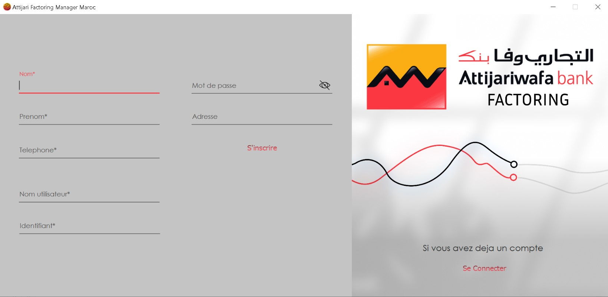
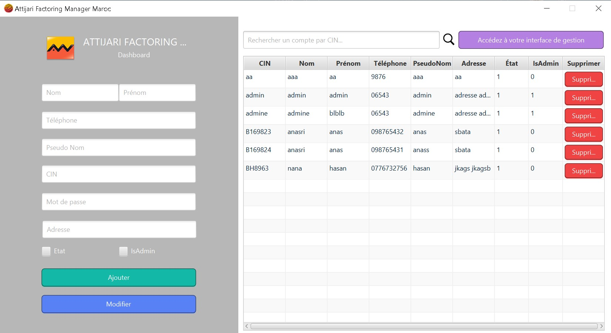

  

  <h1>AFMM</h1>
  <h1>(SupplierManagementSystem)</h1>
  
Supplier Management System with Payment and PDF Generater

<!-- Badges -->

[//]: # (About the Project)
## :star2:About the Project

The main objective of this project is to provide a user-friendly interface for adding suppliers and making payments, while automating the generation and sending of necessary PDF files.
This aims to facilitate and streamline the process of supplier and payment management by reducing manual tasks and enhancing efficiency.
The application should enable users to quickly and easily add suppliers, choose their preferred payment method, and generate the required PDF files for future submissions.

## :computer: Technologies Used

The Supplier Management System is built using JavaFX, a Java library for building desktop applications with a modern user interface.

## :rocket: Getting Started
-->

  ## :hammer_and_wrench: Show

    

    
    
    
    
    
    
    

### Prerequisites

- JavaFX: Ensure that you have JavaFX installed on your system. You can download it from the [official website](https://openjfx.io/).
